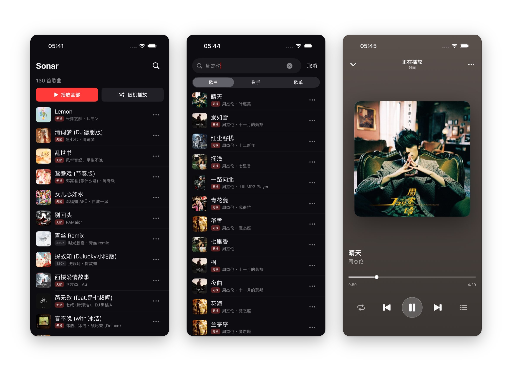
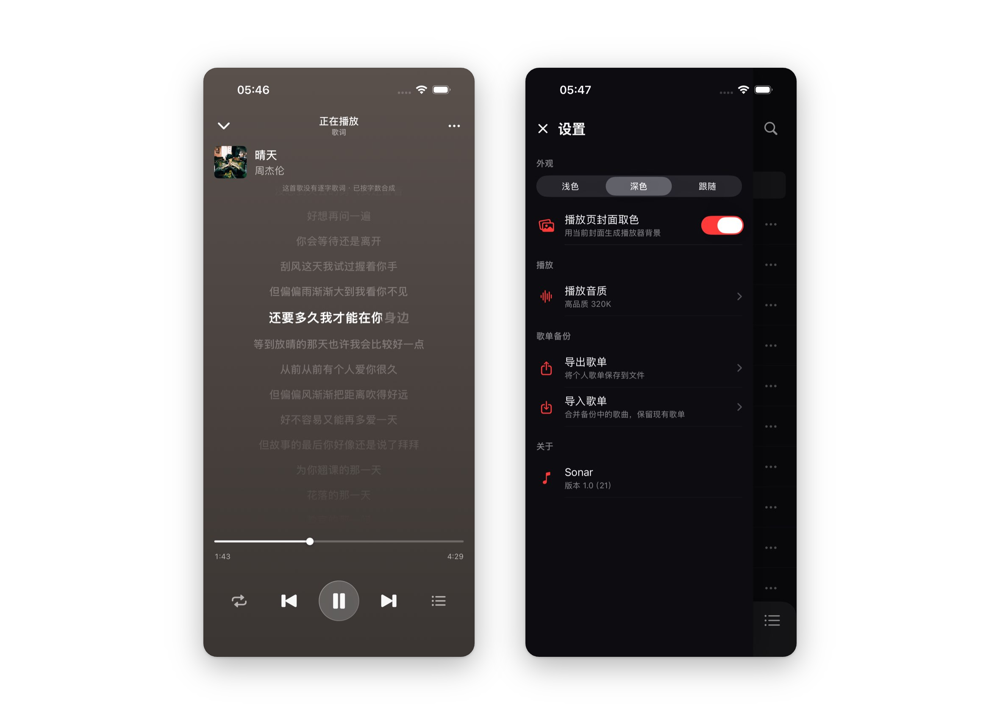
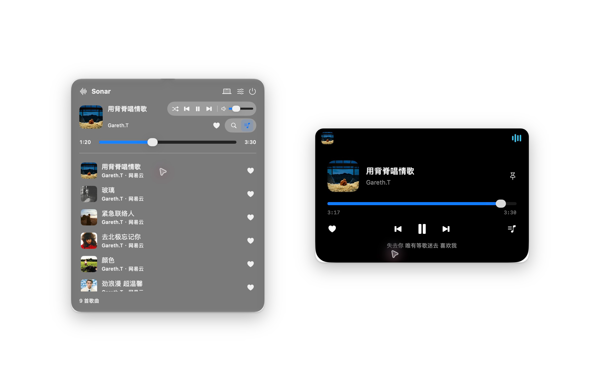
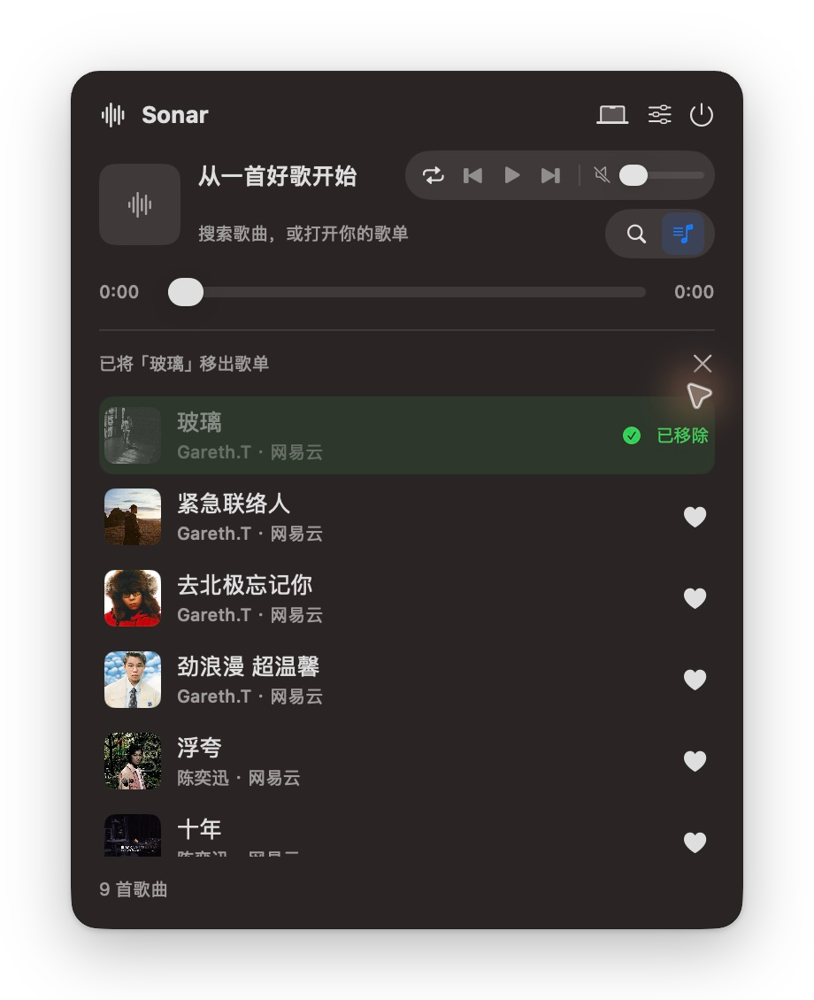

<p align="center">
  
</p>

<h1 align="center">Sonar</h1>

<p align="center"><strong>🐋 在深水里靠声音辨路。</strong></p>
<p align="center">原生 iOS 与 macOS 音乐播放器，让搜索、收藏与聆听回归纯粹。</p>

<p align="center">
  
  
  
  <a href="LICENSE"></a>
  <a href="https://linux.do/"></a>
</p>

<p align="center">
  <a href="#界面预览">界面预览</a> ·
  <a href="#功能">功能</a> ·
  <a href="#运行与安装">运行与安装</a> ·
  <a href="#从源码构建">从源码构建</a> ·
  <a href="#数据与音源">数据与音源</a> ·
  <a href="#致谢">致谢</a>
</p>

## 界面预览

### iOS

<p align="center">
  <a href="assets/previews/ios-main.png"></a>
</p>

<p align="center">
  <a href="assets/previews/ios-details.png"></a>
</p>

### macOS

<p align="center">
  <a href="assets/previews/macos.png"></a>
</p>

<p align="center">
  <a href="assets/previews/macos-removal.png"></a>
</p>

## 功能

- **音乐搜索**：歌曲可手动选择 QQ 音乐或网易云；歌手、歌单、联想、热搜与发现歌单使用 QQ 音乐。
- **封面与歌词**：播放页随封面取色，支持明暗外观、同步歌词与逐字高亮；缺少逐字时间时会明确标注合成效果。
- **本地歌单**：用 SwiftData 保存收藏和歌曲信息，支持 JSON 导入、导出与重复歌曲去重。
- **播放队列**：支持下一首播放、加入待播，以及随机、单曲循环、顺序播放和列表循环。
- **Mac 随手播控**：状态栏选歌面板与顶部播放器共享播放、收藏状态，支持悬停展开、封面、歌词、进度和音量控制；取消收藏提供确认高亮与收起动画。
- **最高音质优先**：默认先请求母带，再按 Hi-Res、无损、320K、128K 逐级尝试；保持同一音源和歌曲 ID。
- **歌单迁移**：粘贴 QQ 音乐或网易云音乐的公开歌单链接或 ID，预览后按原顺序合并，自动跳过已收藏歌曲。

Sonar 没有开屏广告或内置社交页面。歌曲、封面和歌词来自第三方服务，可用性与实际播放音质取决于歌曲和音源；歌单备份保存歌曲信息，不包含音频文件。

## English overview

Sonar is a native SwiftUI music player for **iOS 17+ and macOS 14+**. Song search supports QQ Music and NetEase through ChKSz; artist and playlist browsing use QQ Music. It provides local playlists, JSON backup, synchronized lyrics, and playback queues. The Mac app combines a menu bar library with a notch player; displays without a notch use a top capsule. Both surfaces share playback and library state.

Public QQ Music and NetEase playlists can be imported from a share link or playlist ID, with a preview and deduplication before merging into the personal library.

Source code is available under **GPL-3.0**, with separate notices for third-party code. Build both apps from `Sonar.xcodeproj`; iPhone installation requires your own signing setup. Experimental Mac builds are available in [GitHub Releases](https://github.com/can4hou6joeng4/Sonar/releases). These builds are ad-hoc signed and not notarized. Music availability and playback quality depend on third-party services; playlist backups contain metadata, not audio.

## 运行与安装

两端均可从同一个 Xcode 工程构建。Mac 实验预览包见 [GitHub Releases](https://github.com/can4hou6joeng4/Sonar/releases)，附安装说明与 SHA-256 校验值；仓库不分发预编译 IPA。

Mac 预览包使用本地 ad-hoc 签名，没有 Developer ID 签名或 Apple 公证，首次打开可能被 macOS 拦截。请先核对下载来源与校验值，再按系统「隐私与安全性」中的提示决定是否允许打开；也可以按下方步骤自行构建。

| 平台 | 系统要求 | 运行方式 |
| --- | --- | --- |
| iPhone | iOS 17.0+ | 在 Xcode 中选择 `Sonar`，运行到模拟器或配置个人签名后安装到真机 |
| Mac | macOS 14.0+ | 在 Xcode 中选择 `SonarMac`，或使用下方构建脚本 |

自行打包的 iOS App 可通过适用的个人签名工具安装。TrollStore 仅适用于其支持的系统与设备，请先核对兼容性。

## 从源码构建

需要一台 Mac、Xcode 与命令行工具，以及 **Node.js 18+ 和 npm**。Xcode 应包含目标系统所需的 iOS / macOS SDK。建议优先使用下面已验证的环境：

| 工具 | 已验证版本 |
| --- | --- |
| Xcode | 27.0（27A266a） |
| Node.js | 24.19.0 |
| npm | 11.17.0 |

2026-10-05 已在上述环境中从公开仓库独立拉取，完成音源构建、iOS 模拟器构建、未签名 IPA 打包及 Mac 双架构（Apple Silicon / Intel）构建，无需作者的音源凭据。较旧的 Xcode 或 Node.js 18 组合尚未单独验证。

仓库已提供 `Sonar.xcodeproj`、共享 Scheme 和音源资源，不需要本地 Agent 框架。直接使用现有工程即可；仅在修改 `project.yml` 并重新生成工程时需要 XcodeGen。App 与 Widget 的构建版本应保持一致。

### 获取源码与构建音源

```sh
git clone https://github.com/can4hou6joeng4/Sonar.git
cd Sonar
npm ci
npm run build:source
```

音源运行时使用 JavaScriptCore。修改 `js-source/` 或音源入口后，应重新执行 `npm run build:source`。

### 运行 iOS App

打开 `Sonar.xcodeproj`，选择 **Sonar** Scheme 和 iPhone 模拟器，点击 Run（`⌘R`）。

安装到真机时，在 Xcode 的 **TARGETS → Signing & Capabilities** 中配置：

1. 为 **Sonar** 和 **SonarWidgetExtension** 选择自己的 **Team**，启用自动管理签名。
2. 为两者设置属于自己的唯一 **Bundle Identifier**，例如 `com.example.sonar` 和 `com.example.sonar.widget`。Widget 标识保持为 App 标识加 `.widget`。
3. 在两个 Target 的 **App Groups** 中启用同一个组，例如 `group.com.example.sonar`，替换默认的 `group.cn.bobochang.sonar`。确认 `Sonar/Sonar.entitlements`、`SonarWidgetExtension/SonarWidgetExtension.entitlements` 与签名描述文件中的组一致。
4. 连接并选择自己的 iPhone，点击 Run。

App Groups 的可用性取决于开发者账户及签名工具；免费账户或部分侧载工具可能不支持该能力。构建成功后，仍需确认 App、Widget、Bundle ID 和 App Group 都与所用签名匹配。

### 运行 Mac App

在同一工程中选择 **SonarMac** 和 **My Mac**，或运行：

```sh
./script/build_and_run.sh --verify
```

脚本会生成 `build/macOS/Build/Products/Debug/SonarMac.app`，使用无需开发者证书的本地 ad-hoc 签名，并启动 App。可用 `--debug` 进入 LLDB、`--logs` 查看日志、`--telemetry` 查看播放切换事件。

本地 ad-hoc 签名适用于自行构建运行。面向其他用户分发时，Developer ID 签名与公证需要另行配置。

Mac 启动后显示状态栏图标及已启用的顶部播放器。点击状态栏图标打开选歌面板；播放列表、搜索、顶部播放器开关和歌单备份均在面板内。面板关闭后播放继续，退出按钮在面板右上角。无刘海屏幕使用顶部胶囊。

点击歌曲旁的空心爱心加入个人歌单，再点实心爱心取消收藏。状态栏歌单、搜索结果、当前歌曲与顶部播放器的收藏状态会同步更新。

歌单与搜索结果保留正常滚动并隐藏滚动条，方便直接点击右侧爱心；歌曲行的播放和收藏操作都可直接完成。

取消收藏后，歌曲行会短暂显示“已移除”，再淡出收起；提示带上歌名，便于确认操作结果。

### 自行打包 IPA

以下命令生成未签名 IPA；通过 Xcode 安装到真机的签名配置见[运行 iOS App](#运行-ios-app)。

```sh
set -e

xcodebuild -project Sonar.xcodeproj -scheme Sonar \
  -configuration Release -destination 'generic/platform=iOS' \
  -archivePath build/Sonar.xcarchive archive \
  CODE_SIGNING_ALLOWED=NO CODE_SIGNING_REQUIRED=NO \
  CODE_SIGN_IDENTITY='' DEVELOPMENT_TEAM=''

# 在独立临时目录中封装，避免混入之前的 Payload
SONAR_IPA_STAGE="$(mktemp -d "${TMPDIR:-/tmp}/sonar-ipa.XXXXXX")"
mkdir -p "$SONAR_IPA_STAGE/Payload"
cp -R build/Sonar.xcarchive/Products/Applications/Sonar.app "$SONAR_IPA_STAGE/Payload/"
(cd "$SONAR_IPA_STAGE" && zip -qr Sonar.ipa Payload)
mv "$SONAR_IPA_STAGE/Sonar.ipa" build/Sonar.ipa
rm -rf "$SONAR_IPA_STAGE"
```

产物为 `build/Sonar.ipa`。使用个人签名工具安装时，需同时处理 App 与内嵌 Widget 的签名，并保持 Bundle ID、App Group 与描述文件一致；具体安装方式以设备和工具的支持范围为准。若构建时注入了个人音源凭据，安装包也会包含这些值，请勿公开分发。

## 数据与音源

### 本地资料库

歌单与歌曲元数据保存在本机。iOS 设置中的「歌单备份」和 Mac 面板设置支持 JSON 导入、导出；导入会追加新歌曲并跳过重复项。两端资料库独立，可用备份手动迁移。

当前启用 QQ 音乐和通过 ChKSz 提供的网易云歌曲及歌单导入接口。歌曲搜索页可手动选择音源；搜索结果与收藏保留原来的来源和歌曲 ID，播放失败时不会自动换平台或换成同名歌曲。旧网易云收藏及备份可继续使用其原 ID 请求歌词和播放地址。

Mac 资料库位于 `~/Library/Application Support/cn.bobochang.sonar.mac/Sonar.store`；启用 App Sandbox 签名时位于应用容器对应目录。资料库打开失败时保留原文件，并提供重试与原始资料导出。

### 播放解析凭据

公开源码不包含个人音源凭据，未配置凭据也可以构建，并使用 QQ 搜索、歌词和公开歌单导入。QQ 播放地址，以及网易云歌曲搜索、歌词、歌单读取和播放地址，均通过 ChKSz 获取，需要配置有效凭据；实际播放与音质仍取决于第三方服务的可用性。可通过构建环境变量配置：

| 变量 | 用途 |
| --- | --- |
| `SONAR_CHKSZ_KEY` | ChKSz 的 QQ 播放解析及网易云歌曲、歌单接口凭据 |

构建脚本生成 `BuildCredentials.json` 并打包到 App。该文件已被 Git 忽略；使用凭据应遵循相应服务的授权范围和使用条款。

<details>
<summary>播放解析与切歌</summary>

两种音源的播放地址均使用 ChKSz，不再回退 QQ 游客接口或网易客户端直连接口。网易云使用 `/api/163_search`、`/api/163_lyric`、`/api/163_music`，并通过 `/api/163_playlist` 导入公开歌单；在线歌手与歌单浏览继续使用 QQ 音乐。

默认从接口支持的最高母带音质开始：QQ 按 `master → hires → flac → 320k → 128k`，网易云按 `jymaster → hires → lossless → exhigh → standard` 请求。更新到此策略时，原来的首选音质会迁移为母带优先；之后手动选择其他音质仍可调整起点。搜索结果中的音质标记不限制播放解析的尝试档位。

在 iOS 设置或 Mac 状态栏面板的设置中选择「从其他播放器导入」，粘贴公开歌单分享链接或输入歌单 ID。链接会自动识别音源，纯 ID 使用所选音源。QQ 复用公开歌单详情并读取后续分页；网易云使用 ChKSz 的 [`/api/163_playlist`](https://api.chksz.com/docs/163_playlist.html)，沿用现有构建凭据。普通长链接及通过 HTTP 跳转的官方短链接可用；无法识别的短链接可改用完整链接或 ID。

导入前显示歌单名称、来源和歌曲数量，预览不会写入资料库。确认后按「音源＋歌曲 ID」去重并保留顺序，合并到个人歌单；不按歌名跨来源替换。一次最多读取 5,000 首；缺失或无效歌曲明确显示，部分结果需点击「导入已读取的歌曲」。服务失败或保存失败保留已有数据，未提供私密歌单登录或自动同步。

未返回可用链接、已知音质或歌曲权限错误、返回了低于请求档位的音质时，尝试下一档；媒体链接经 HTTPS 和有界探测验证后，按返回音质缓存。网络错误、凭据缺失和 HTTP 503 等服务错误会直接停止并提示失败。两种音源依赖同一第三方服务，恢复网易云并不保证能避开服务整体故障。参数以 [QQ 文档](https://api.chksz.com/docs/qq_music.html)和[网易云文档](https://api.chksz.com/docs/163_music.html)为准。

Mac 会按当前播放模式提前解析并缓冲下一首。插歌、删歌、排序和模式切换会更新准备目标；音源尚未就绪时仍需等待网络。`--telemetry` 记录解析、媒体就绪和开始播放的阶段耗时，不包含歌曲信息、播放地址或凭据，也不等同于音频输出设备的实测静音间隔。

</details>

## 反馈与参与

欢迎通过 [GitHub Issues](https://github.com/can4hou6joeng4/Sonar/issues) 反馈问题或建议。说明系统版本、触发步骤与实际表现；播放问题可附歌曲名称和来源，截图与日志请先移除凭据和个人信息。

## 免责声明与合规说明

> **请在阅读并理解以下条款后再使用或参与本项目：**

1. **项目目的与代码许可**：Sonar 起源于个人兴趣和原生 iOS/macOS 架构实践。自有代码按 GPL-3.0 授权，使用、修改和再分发的权利与义务以许可证为准，包括许可证允许的商业使用；第三方代码遵循各自的许可。项目目的不构成额外的代码用途限制。
2. **客户端与本地数据**：本项目不运营音乐后端或音频托管服务，不随仓库或安装包分发受版权保护的音视频文件。歌单与歌曲元数据保存在本机；播放涉及的音频流、封面与歌词由客户端按用户操作向第三方服务请求。
3. **知识产权归属**：所有由音源返回的歌曲、歌词、专辑图文及商标等合法知识产权均归属于其各自的原始版权方、歌手、唱片公司或对应在线音乐服务平台。
4. **服务与内容的使用**：代码许可证不授予音乐内容、第三方服务接口或商标的使用权。使用者应遵守相应服务的授权范围、使用条款与所在地法律法规，尊重音乐版权，支持正版音乐服务。
5. **侵权与异议处理**：若任何版权方或个人认为本项目的开源代码对您的合法权益造成了影响，请通过 GitHub Issue 或电子邮件联系维护者，我们将第一时间积极配合下线或调整相关内容。

## 致谢

感谢 [LINUX DO](https://linux.do/) 为开发者提供分享作品、交流想法的空间，也感谢社区中愿意分享经验与开源实践的佬友。

- [lx-music-mobile](https://github.com/lyswhut/lx-music-mobile)：Sonar 的音源与辅助代码基于其开源实践适配，来源说明保留在源码与许可材料中。
- [Atoll](https://github.com/Ebullioscopic/Atoll)：Mac 顶部播放器的交互参考；Sonar 使用自己的窗口、界面与播放实现，未引入其源代码或素材。

第三方代码、依赖与许可说明见 [THIRD_PARTY_NOTICES.md](THIRD_PARTY_NOTICES.md) 和 [LICENSES/](LICENSES/)。

## 开源许可证

Sonar 自有代码采用 [GNU General Public License v3.0（GPL-3.0）](LICENSE)。修改与再分发须遵循该许可证；第三方代码保留各自的许可与归属说明。
